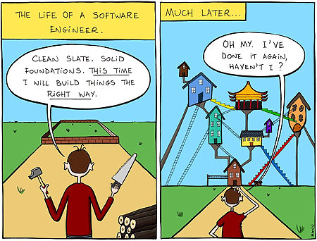
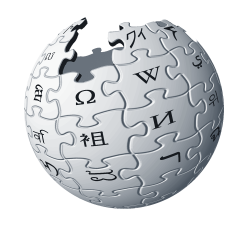
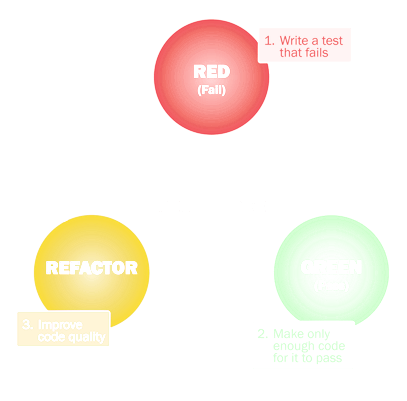

# Refactoring

*Cleaning up your code*

MeetPy @ MPIA – Feb 7, 2018

---

**Refactoring** is the process of restructuring existing code *without* changing
its external behaviour. […] Typically, refactoring applies a series of
standardised basic micro-refactorings. […]

---

# Why refactor?

- Make the code easier to understand
- Make it easier to add new features or change the code

---

# Refactoring and tests

---

# What it is not

- Optimize for performance, memory usage etc.
- Fixing bugs
- Changing the overall design
- Rewrite your code

---

# How?

- Code smell: surface indicators of deeper design problems
- Analyse what the problem is
- Refactor to mitigate

---

# Code smells

- Duplicated code
- Comments
- Long method or function
- Long parameter list
- Magic values
- Conditional complexity
- Combinatorial explosion
- Large class or module
- Uncommunicative names
- Inconsistent names
- Dead code
- Feature envy
- …

---

# Refactoring techniques

- Rename function or variable
- Move function or variable
- Extract class or module
- Extract function or method
- Generalize type or function
- Replace conditional with polymorphism
- …

---

# Literature

Martin Fowler: *Refactoring*, Robert C. Martin: *Clean Code*
